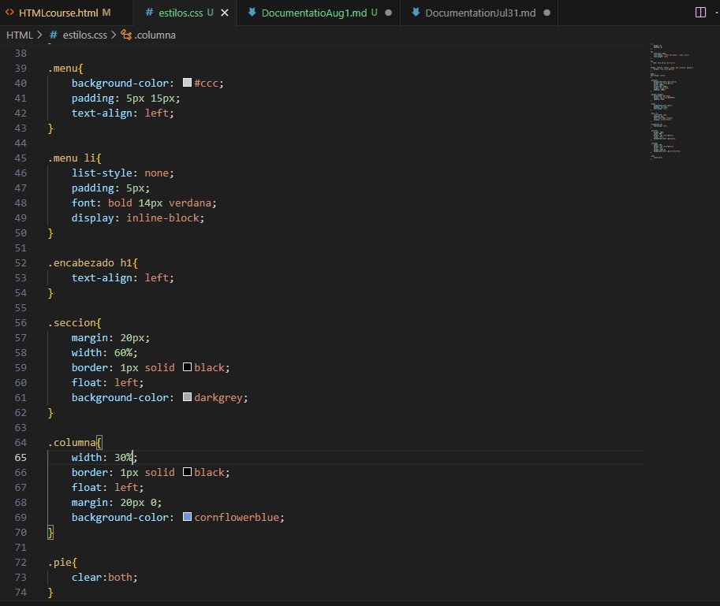
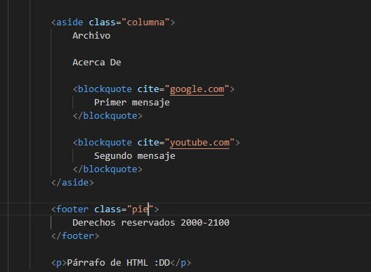
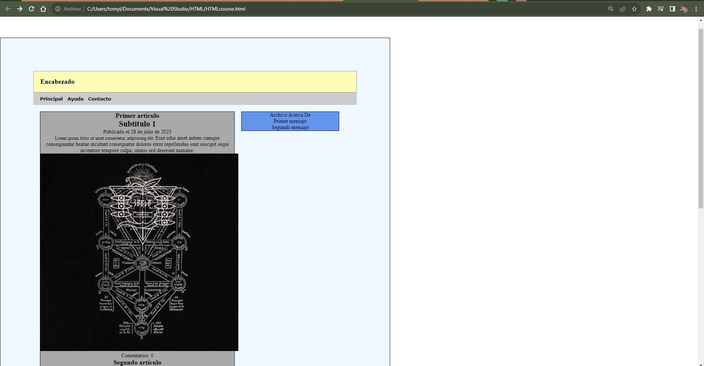

# Documentation Aug/1

## Status

* CSS course finished. Now I'm going to practice it.
* Beginning the Javascript course.
* Practicing git, I think that it's easier than previous days.

## Blockers

* None

## Observations

* I didn't know about two programming languages that works together to get a nice result.
* The settings interesting and a lot, however, now there are updated or modified commands so I've to search about some of them.
* For the changes of the code, check directly in the repository.

