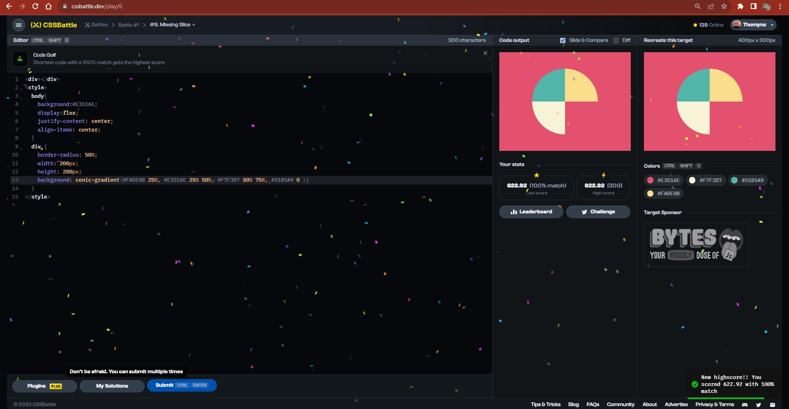

# Documentation Aug/11

## Status

* Watched half of the fourth video of the bootcamp.
* Getting problems with the code and React.
* Doing more CSS exercises.

## Blockers

* I was watching the video taking notes and copying the code but the localhost didn't show me the results. I compared the video's code and mine but it's all the same. I don't know what was wrong so I decided to do more exercises of CSS.

## Observations

* For doing the exercises I searched for especial commands in internet, by example:

https://www.smashingmagazine.com/2022/01/css-radial-conic-gradient/

