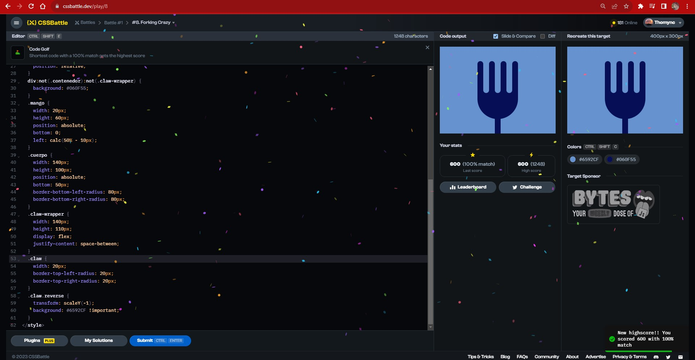
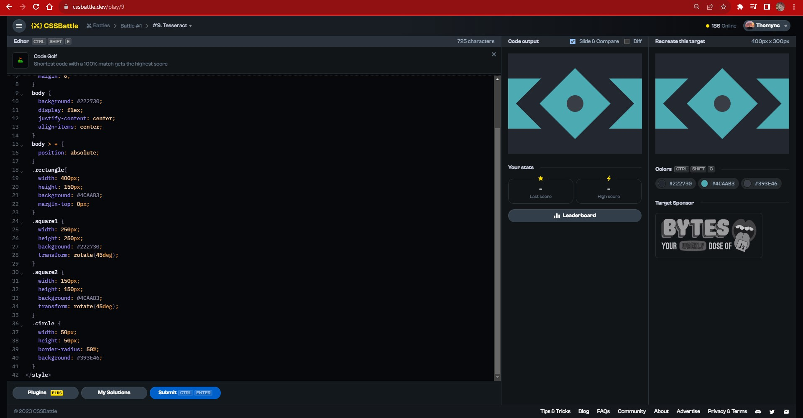
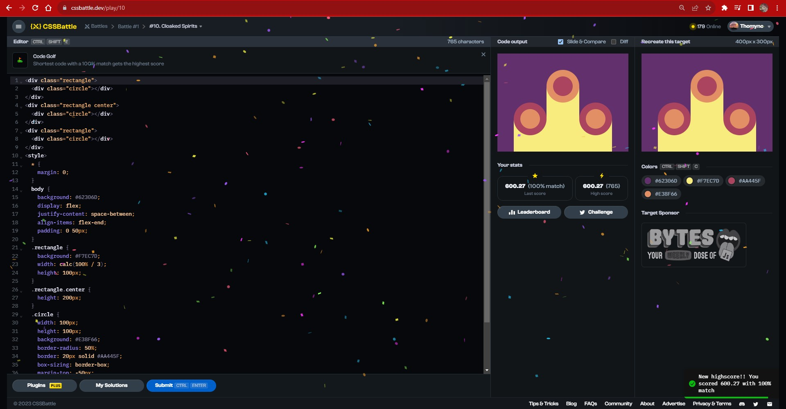

# Documentation Aug/14

## Status

* Fourth video finished.
* Beggining the fifth video of the bootcamp course.
* Doing more CSS exercises.
* Beggining to do the fullstack course exercises.

## Blockers

* I feel a little confused about the render concept and its use but I'm still investigating.

## Observations

* For a better understanding of the actual video, I decided to watch it fast the first time and then slowly and following the commands used hoping that it help me to get it.

