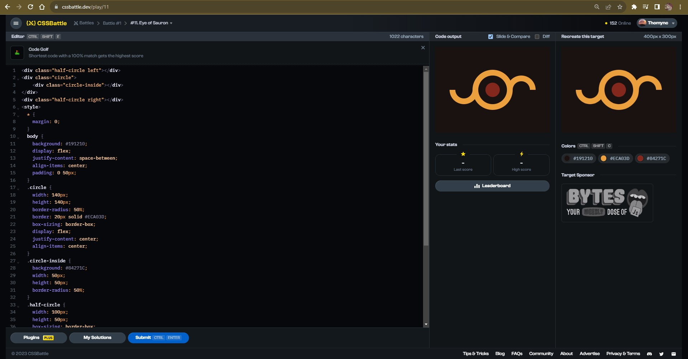

# Documentation Aug/15

## Status

* Fifth video finished.
* Beggining the sixth video of the bootcamp course.
* Doing more CSS exercises.
* Beggining to do the fullstack course exercises.

## Blockers

* My electricity service did fall yesterday and it returned at midday today. I saw the video and copy the code but couldn't do more.

## Observations

* The order of the course videos is weird. In the actual video explains how to use NodeJS to manage the app and create the host but, in previous videos we use it normally.

