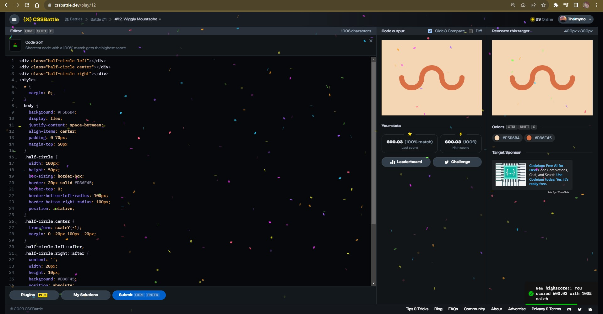
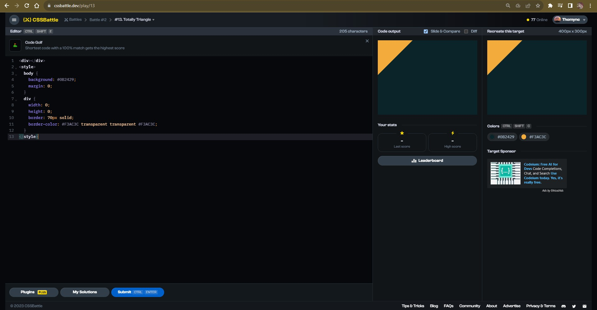
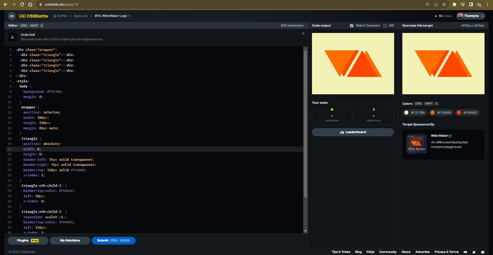

# Documentation Aug/16

## Status

* Sixth video finished.
* Watching the seventh video of the bootcamp course.
* Doing more CSS exercises.
* Beggining to do the fullstack course exercises.

## Blockers

* None.

## Observations

* The order of the course sometimes confuses me. In the actual video explains how to use NodeJS to manage the app and create the host but, in previous videos we use it normally.
* I'm understanding the code as the course progress.

