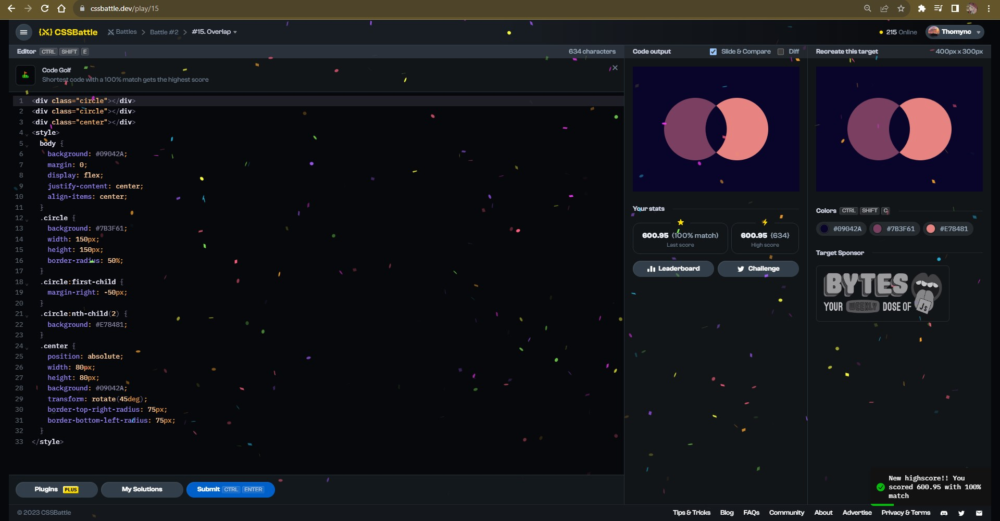
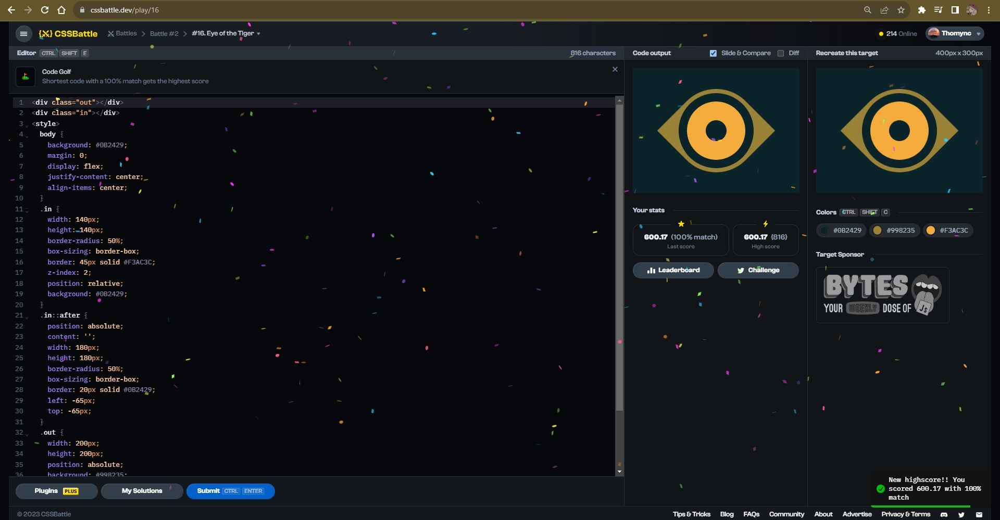
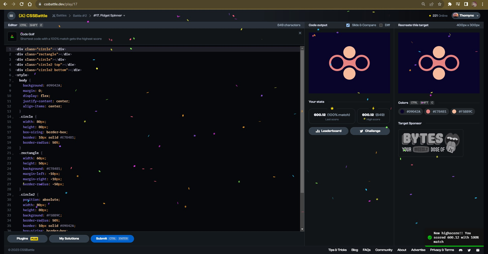
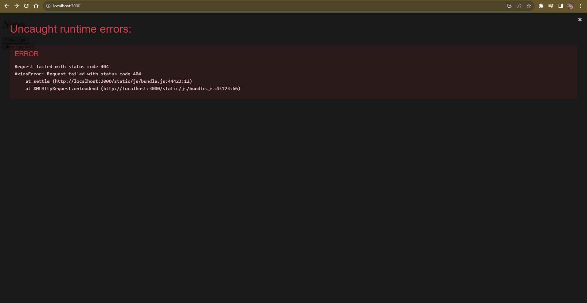
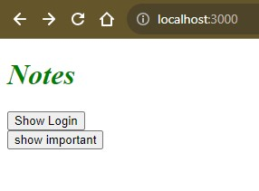

# Documentation Aug/17

## Status

* Seventh and eigth video finished.
* Watching the nineth video of the bootcamp course.
* Doing more CSS exercises.
* Trying to fix the project code.

## Blockers

* None.

## Observations

* I'm getting cofused for all the *extensions* added for programming. I mean, I think that they're necessary but I don't get a familiar sense when I use them.
* I think that I'm having a nice CSS improvement, now I can do the exercises with a better knowledge, comparing it with the start of the course.
* Trying to fix the code is a great exercise for get a better understanding of Javascript and its tools.

