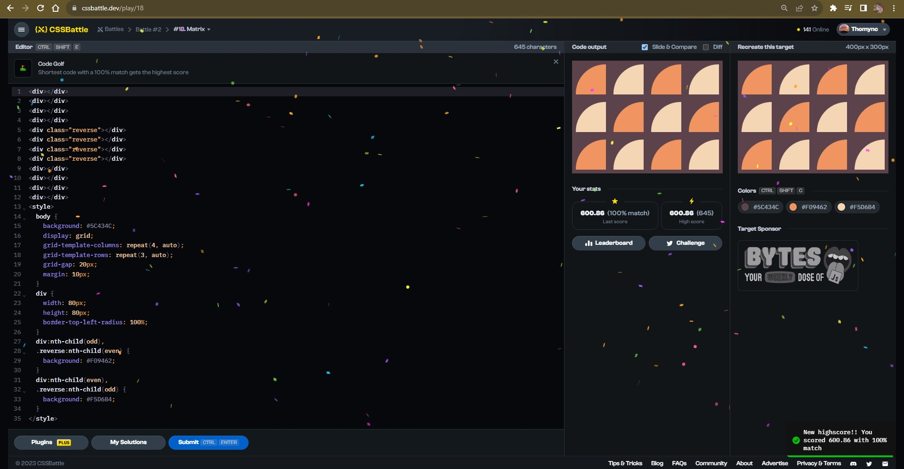
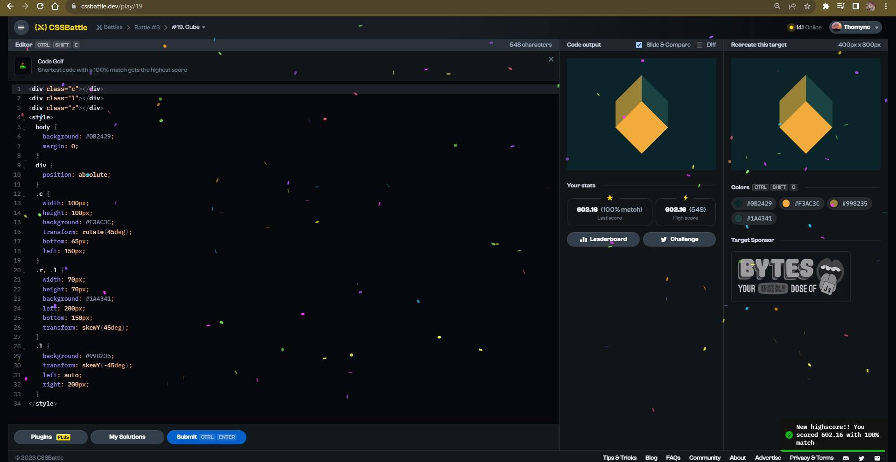
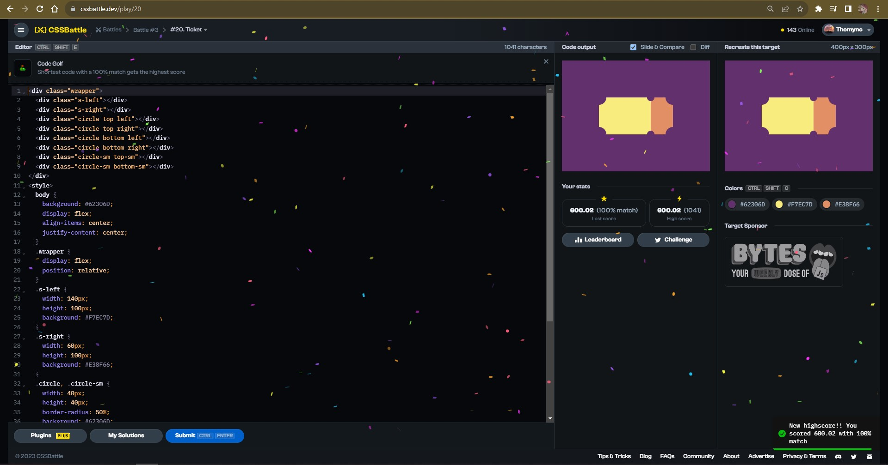
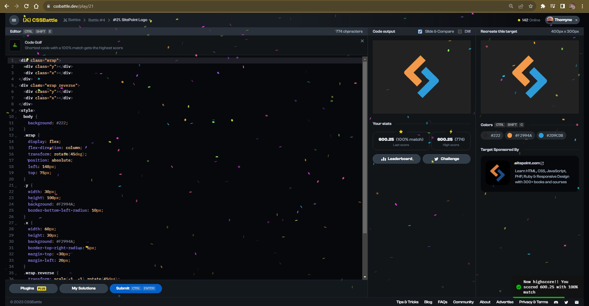
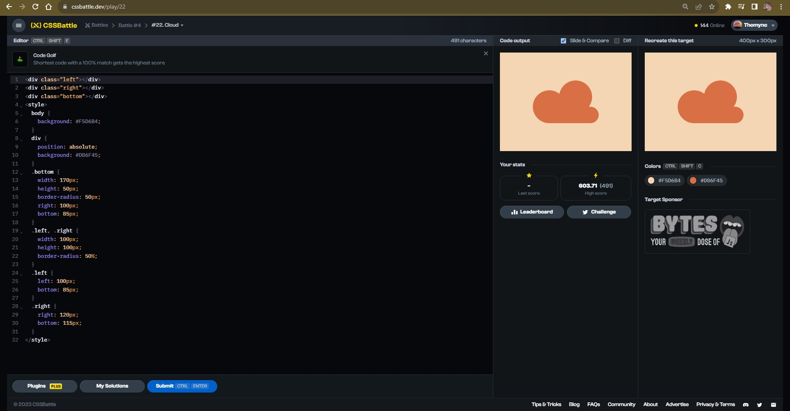

# Documentation Aug/18

## Status

* Nineth to fourteenth video finished.
* Watching the fifteenth video of the bootcamp course.
* Doing more CSS exercises.
* I decided to take a brake of fixing the code but reading more about the topics of the course and watching more examples about databases.

## Blockers

* None.

## Observations

* Trying to fix the code is a great exercise for get a better understanding of Javascript and its tools.

