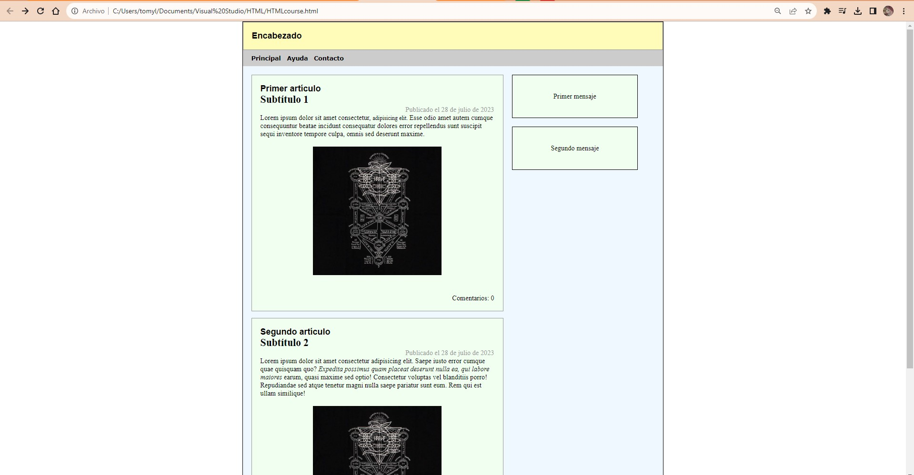
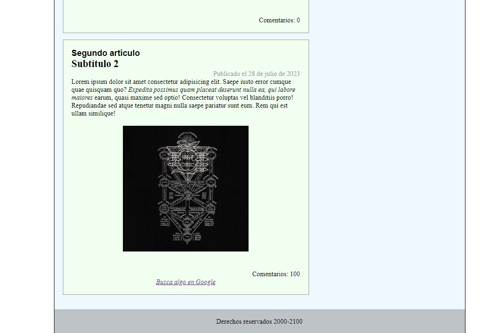
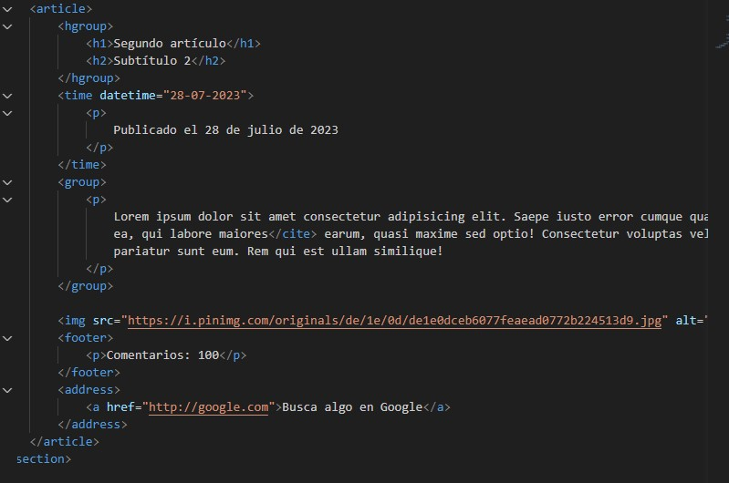
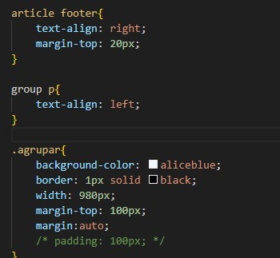

# Documentation Aug/2

## Status

* I've finished my first website only using HTML and CSS.
* Watching the Javascript course.
* I haven't had problems with git, I just have two differents repositories for code and Documentations.

## Blockers

* None

## Observations

* I can create names for grouping elements in HTML, by example, I created a label called *group* to align some paragraphs to the left. 
* I know how to handle text in these languages, so I wanna know how include funcional code to do more interesting things.
* For the changes of the code, check directly in the repository: https://github.com/Thomync/cursos

