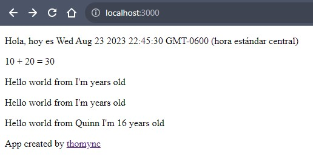
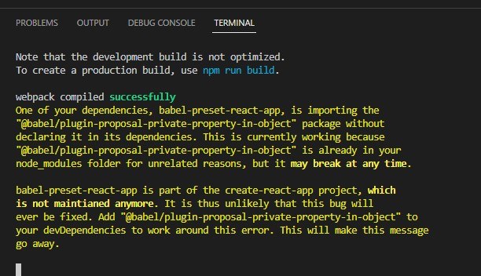
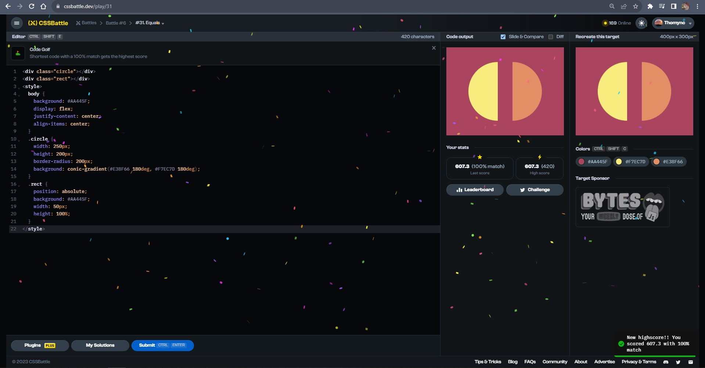
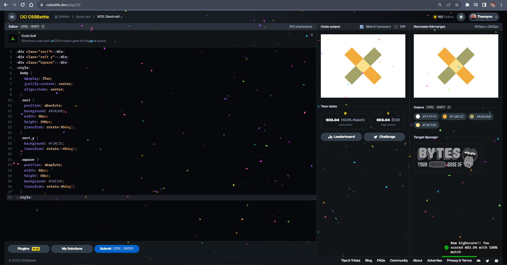

# Documentation Aug/23

## Status

* 23rd to 25th video finished.
* I'm watching the fullstack course from the oficial site and following the exercises.
* Doing more CSS exercises.

## Blockers

* None.

## Observations

* By studying for second time javascript, now I'm understanding it better. I think that the first time doing the course was with a faster rythim and it caused to confuse me.
* By the moment, I'll just upload the exercise codes, in next days I'll add comments and observations in the codes but, I consider that all is well explained in the website. :)

