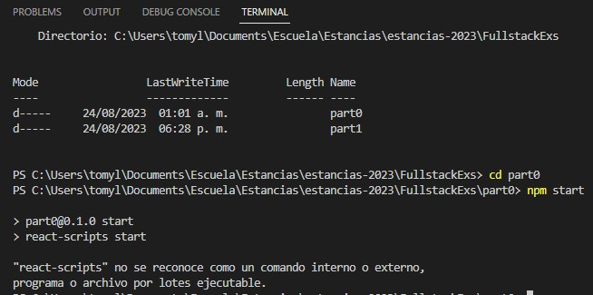
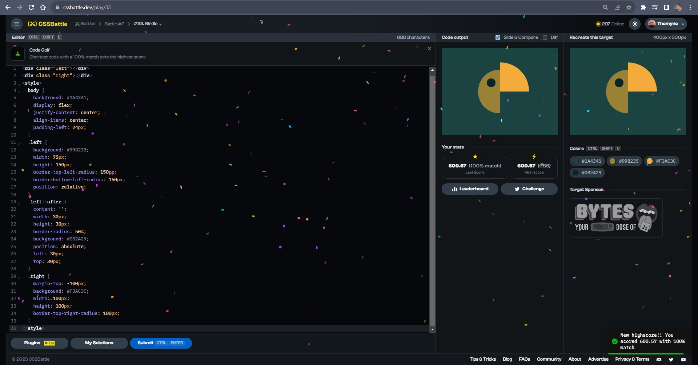
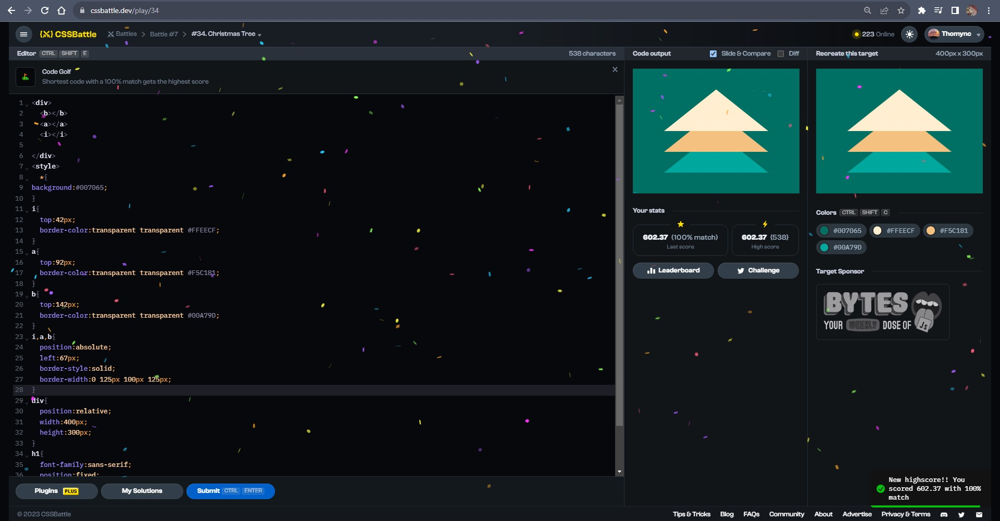
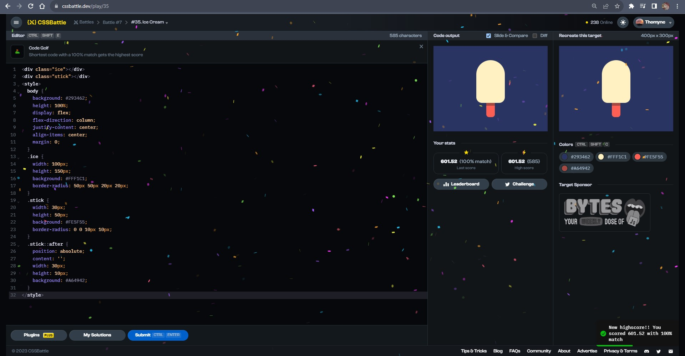
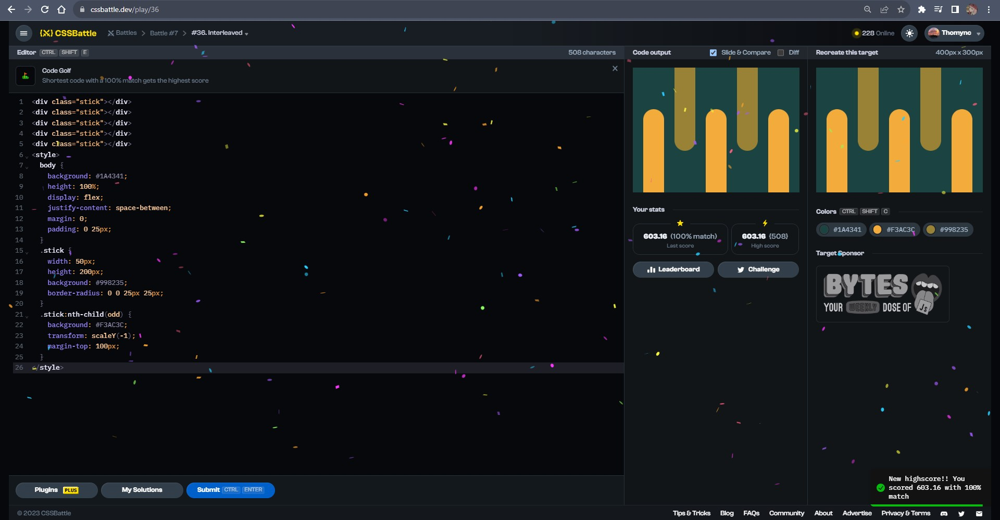

# Documentation Aug/24

## Status

* No videos watched today because I was trying to fix a React error.
* Having problems with my github repository again. I tried to add my new folder of Fullstack exercises but it uploaded the node_modules and was about 10k files so I'm still trying to fix that problem.
* Doing more CSS exercises.

## Blockers

* None.

## Observations

* Sometimes I feel that I'm understanding all the programming environment but somedays surges many error that I can't fix easily.

