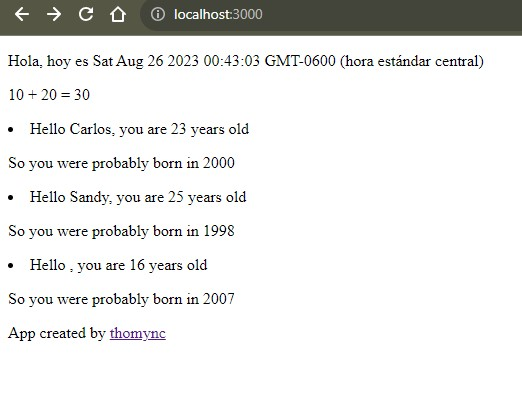

# Documentation Aug/25

## Status

* React errors fixed and progressing with the exercises.
* Studying the material from the fullstack website and completing the exercises. Now I'm really undestanding.
* Doing more CSS exercises.

## Blockers

* None.

## Observations

* Follow the course videos without errors in the code is a need.
* The code notes are updated in their respective folders.

