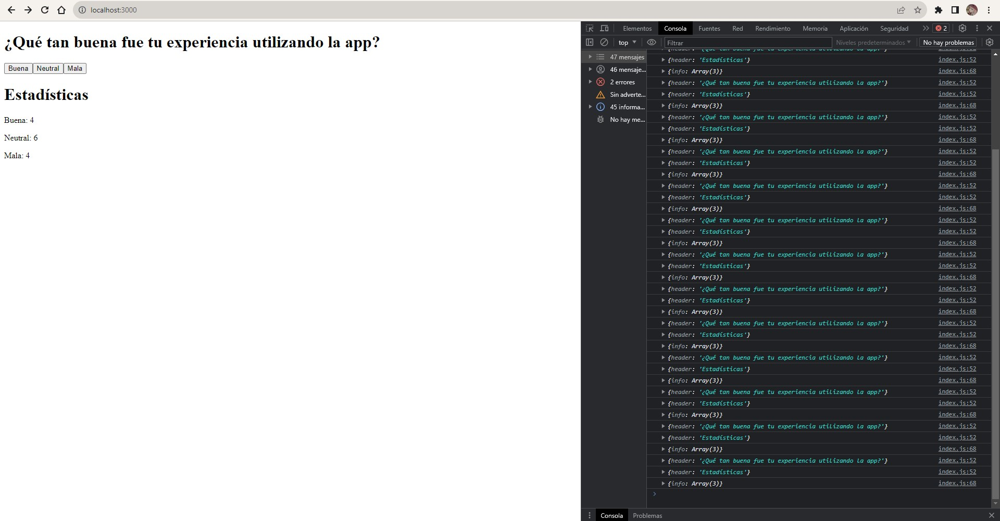
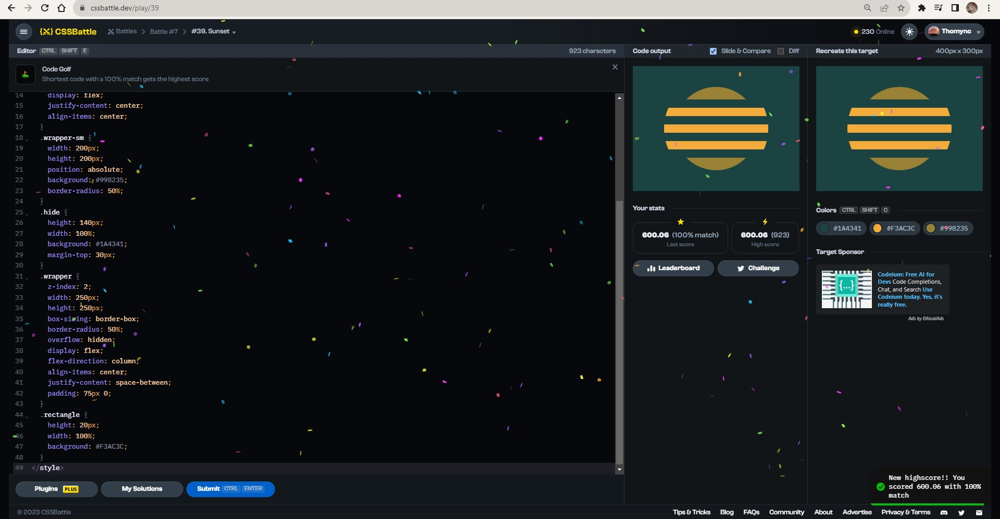
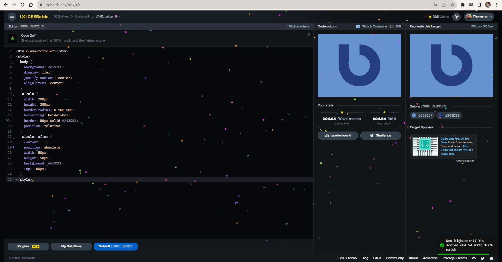
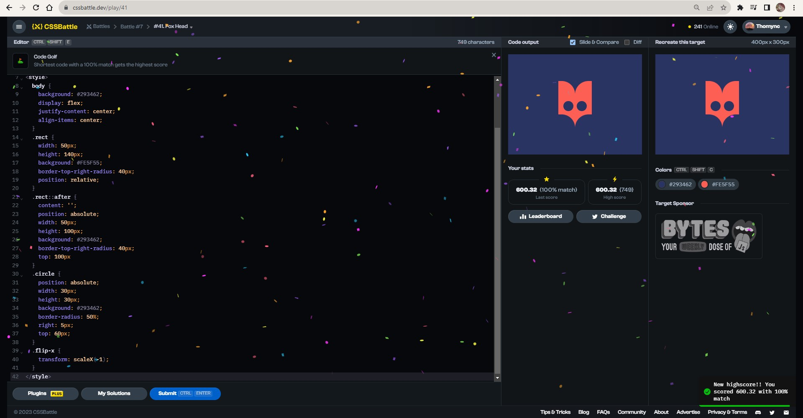

# Documentation Aug/28

## Status

* Progressing with the fullstack exercises.
* Studying the material from the fullstack website and completing the exercises.
* Doing more CSS exercises.

## Blockers

* None.

## Observations

* The last exercise took me a long time because there was an error and I couldn't find it after many attempts.

