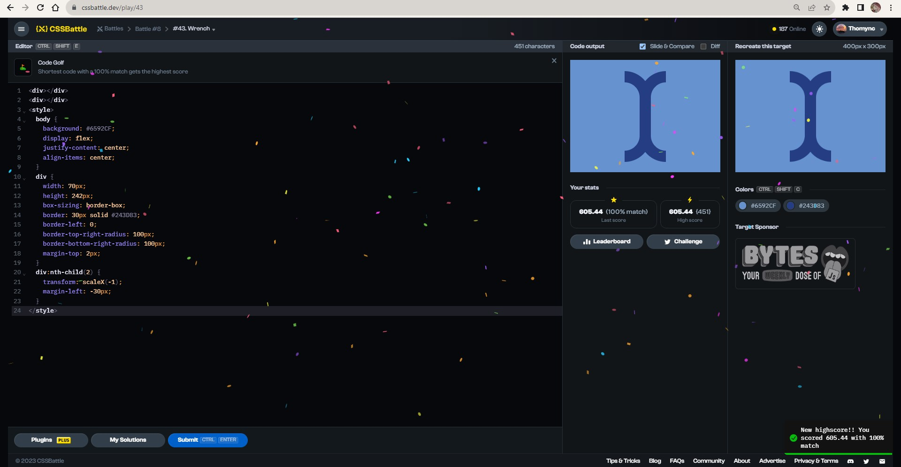

# Documentation Aug/29

## Status

* Progressing with the fullstack exercises. I'm stuck in the 13rd exercise.
* Studying the material from the fullstack website and completing the exercises.
* Doing more CSS exercises.

## Blockers

* I don't understand why the votes matrix doesn't update, I even make it variable.

## Observations

* Worth remembering that the code sources are in the Fullstack and CSS folders.

