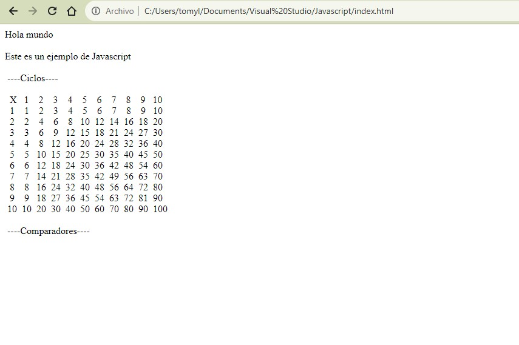

# Documentation Aug/3

## Status

* Finished the Javascript course.
* Doing some exercises using Javascript code.
* I've make a exercise program and get some errors trying to create a matrix for names.

## Blockers

* I'm investigating how to create correctly a matrix in JS. I think it sholud be created using more code lines but I'll try tomorrow.
* Update: I'm having problems to upload my excercise code with git.

## Observations

* Javascript is a nice and extense programming language so I'll search a guide for the commands and more info about it.
* Now I'm thinking about how fuse the three languages to create a funtional website.
* For the changes of the code, check directly in the repository: https://github.com/Thomync/cursos

