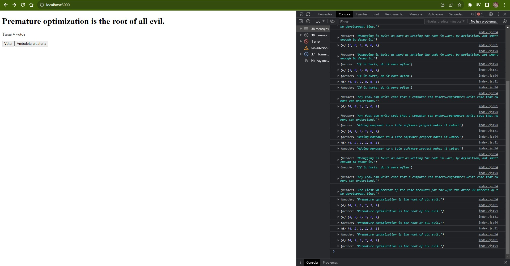
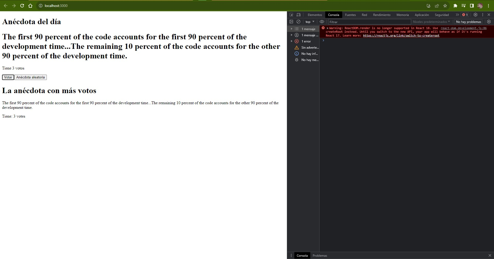

# Documentation Aug/30

## Status

* Completed the part1 of the fullstack course.
* All the part1 exercises completed.
* I decided to stop with the CSS exercises, I can understand the programming language better thant at the beggining of the course.

## Blockers

* My electricity was failing from afternoon and haven't come back, so I just did a progress offline.

## Observations

* Worth remembering that the code sources are in the Fullstack and CSS folders.

