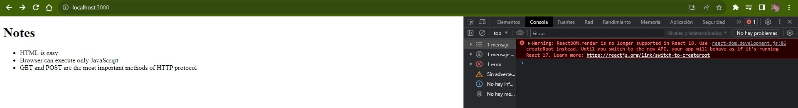
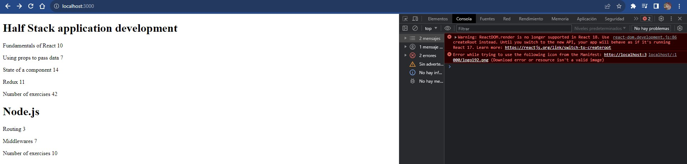

# Documentation Aug/31

## Status

* Completed the first exercises of the part2 of the fullstack course.
* I decided to stop with the CSS exercises, I can understand the programming language better thant at the beggining of the course.

## Blockers

* Today I had problems too but just for a few hours.

## Observations

* Worth remembering that the code sources are in the Fullstack and CSS folders.
* In this time, I didn't separate the exercises, now I just finished the last exercise an it include the previous tasks.

