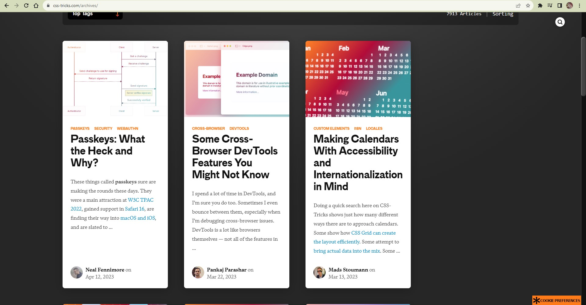
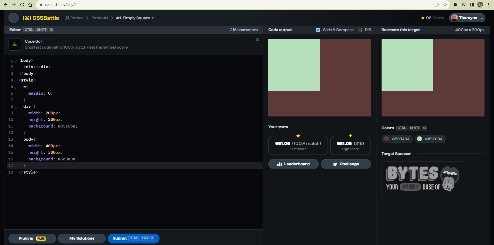
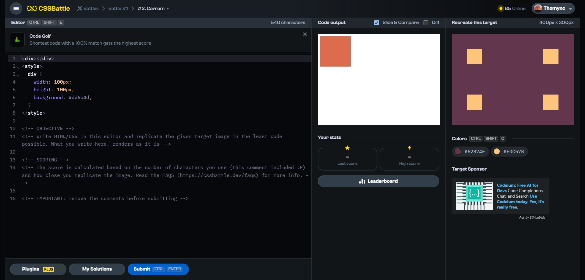

# Documentation Aug/4

## Status

* Playing with some websites to learn more about HTML and CSS.
* Watching the second video of the 5th course.
* Planning to create a new repository for a better archives management.

## Blockers

* I'm still having problems to upload my excercise code with git, so I'm going to create a new repository to fix it.

## Observations

* For the video's example I noticed that exists many paradigms for JS, I'll look for one to use.
* There aren't changes in the code for this time because I didn´t create a new code, I just was playing with the DevTools.
* I'm using some websites to practice and learn more about CSS:
    * https://cssgridgarden.com/#es
    * https://css-tricks.com/archives/
    * https://cssbattle.dev/

