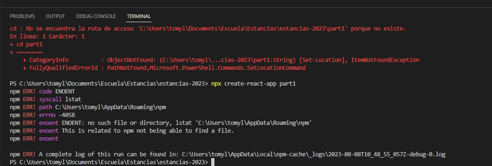
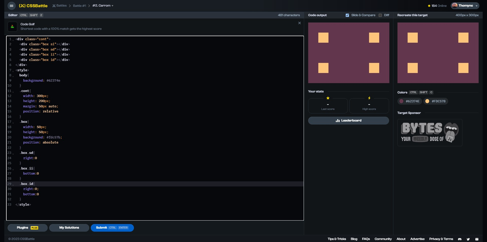
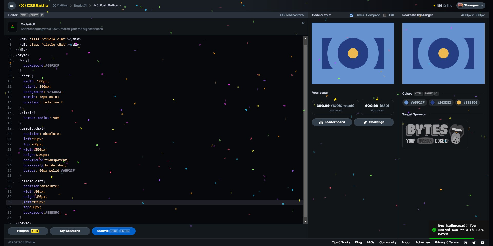

# Documentation Aug/7

## Status

* Still playing with some websites to learn more about HTML and CSS.
* Finishing the second video of the 5th course.
* New repository created: https://github.com/Thomync/estancias-2023.

## Blockers

* I'm having some problems with NodeJS to create the first app.

## Observations

* I think, for the few websites that I have visited, that libreries for JS are a must.
* I'm using some websites to practice and learn more about CSS:
    * https://cssgridgarden.com/#es
    * https://css-tricks.com/archives/
    * https://cssbattle.dev/

