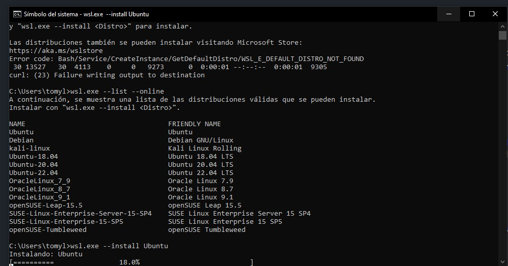
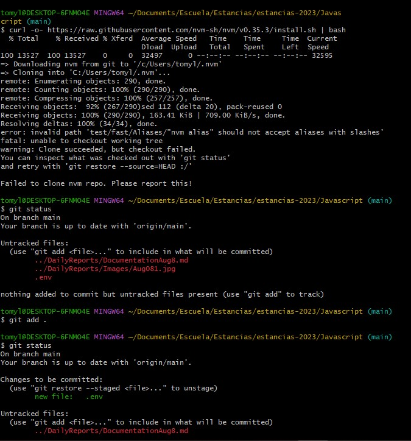
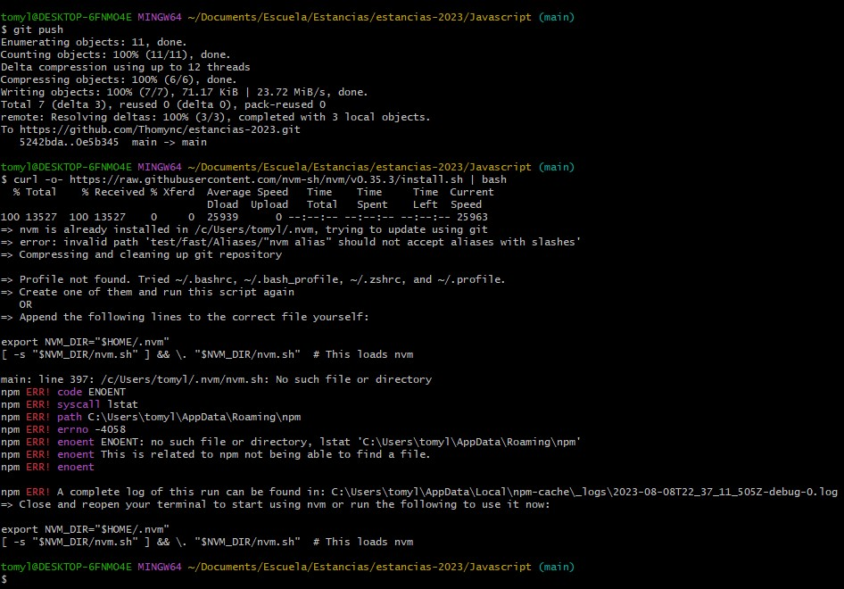
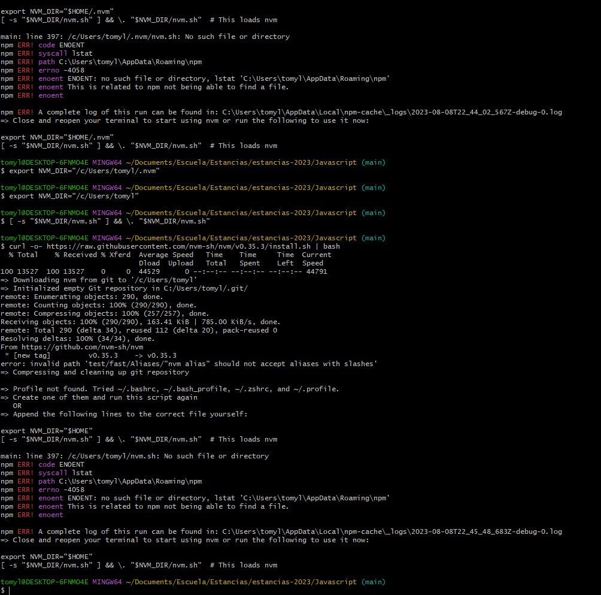
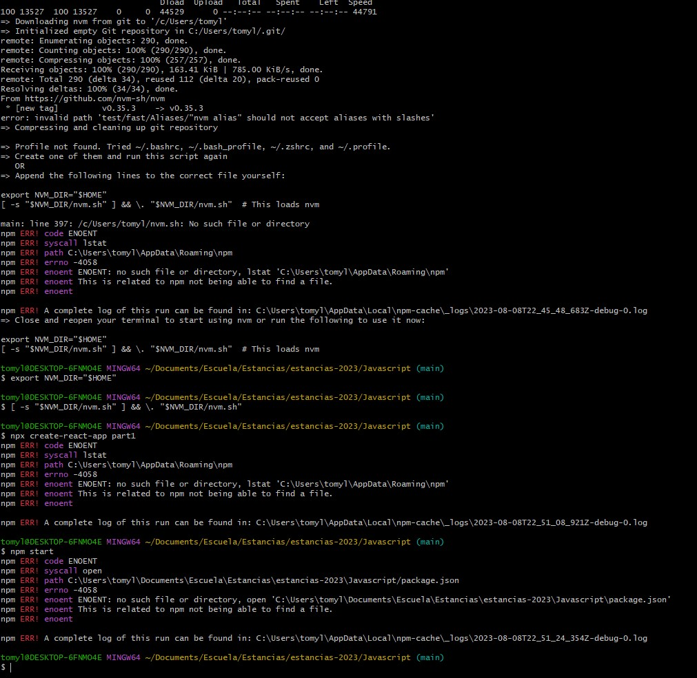
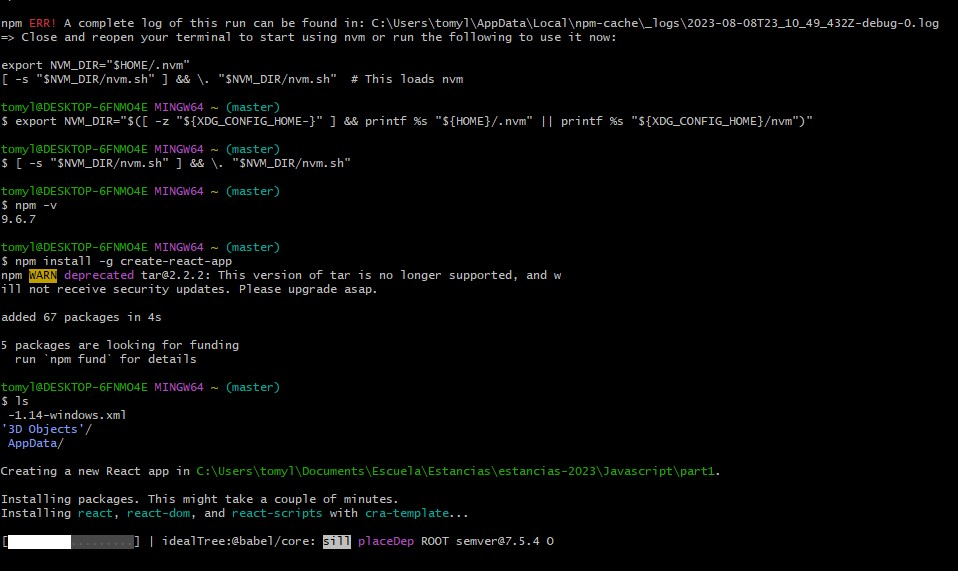
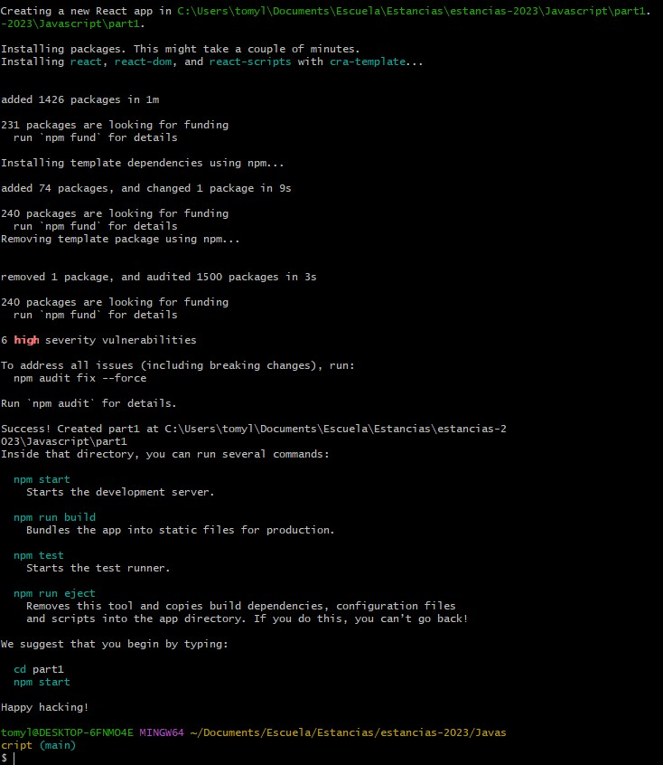
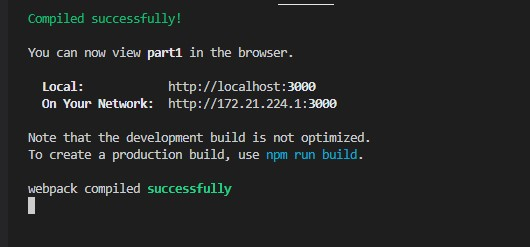
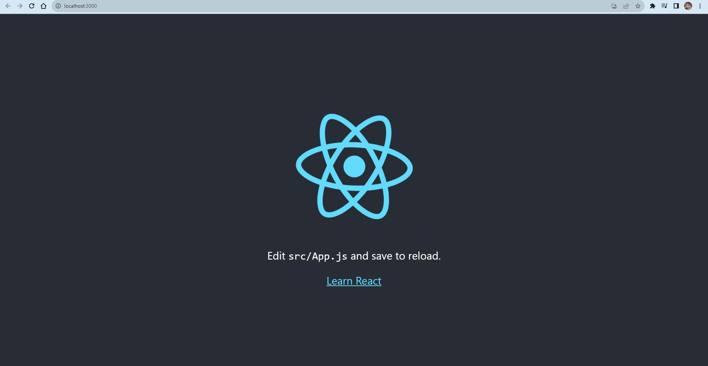
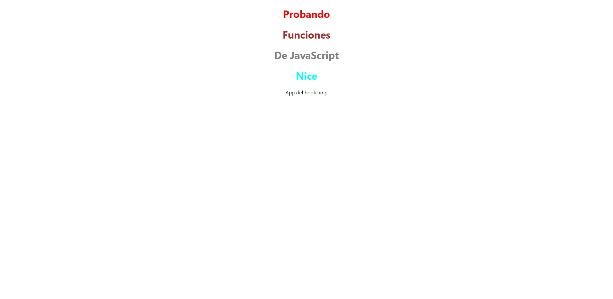

# Documentation Aug/8

## Status

* Resolved the errors with Node.
* Finishing the second video of the 5th course.
* First app and host created.

## Blockers

* None

## Observations

* I'll show how I resolved the errors and the finished website below:

