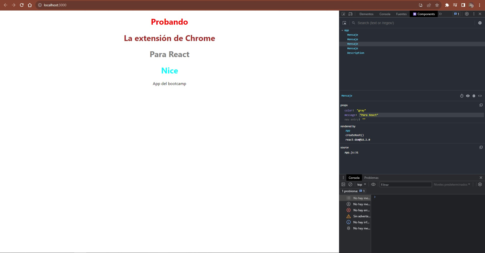
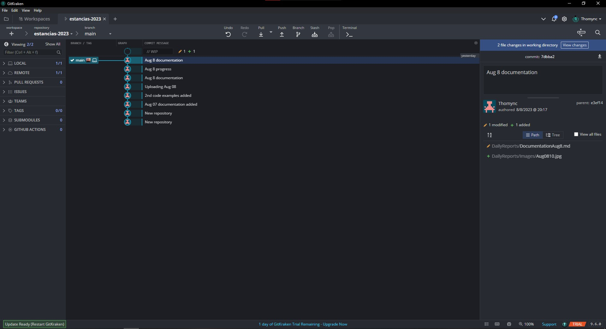
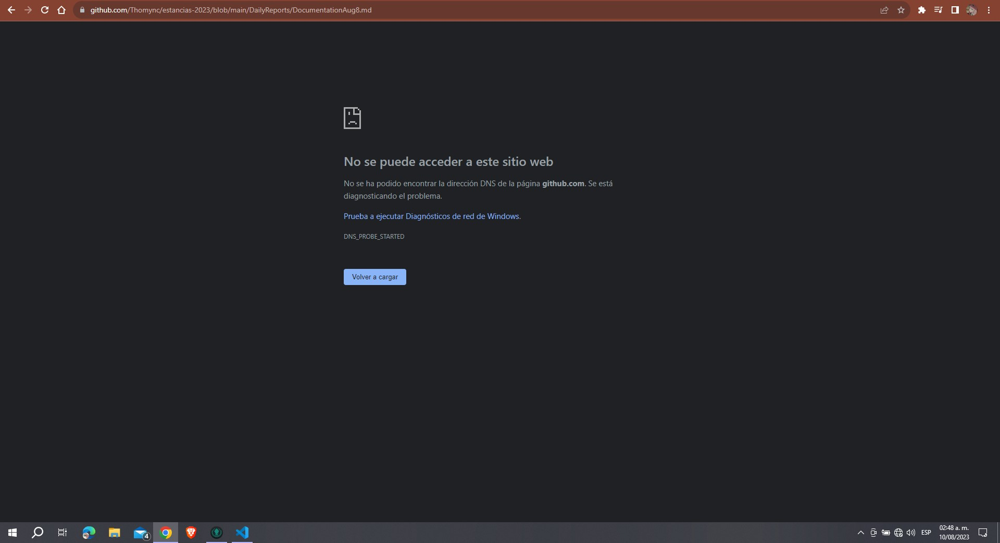
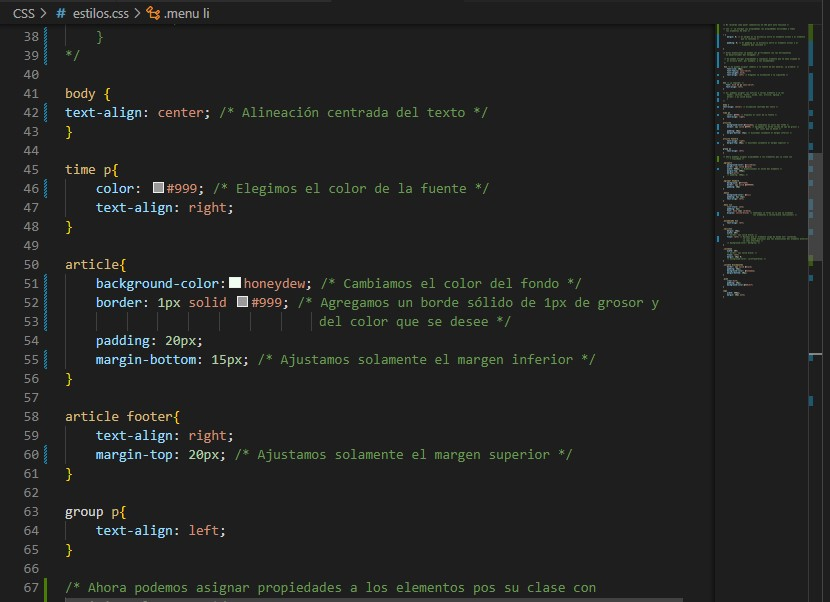

# Documentation Aug/9

## Status

* Beginning the third video of the last course.
* Added a Chrome extension.
* Installed and trying Kraken. I hope that this program helps me to get a better git and github management.
* In my *free time* I organized my last codes and added *notes* and *comments*.

## Blockers

* My internet was fail yesterday since 4:00pm until almost 3:00am, so I couldn't continue watching the video and I haven't more advance today. I hope internet coming back in the morning.

## Observations

* I'll show how I resolved the errors and the finished website below:

