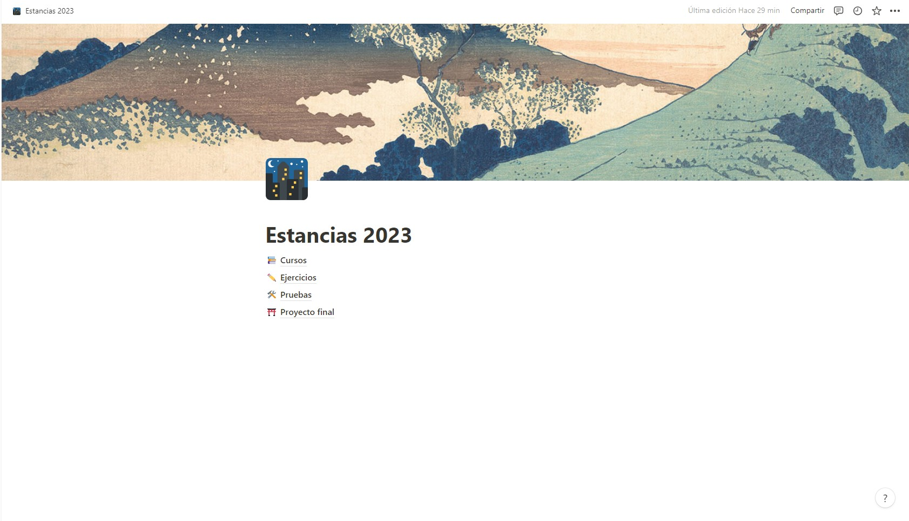
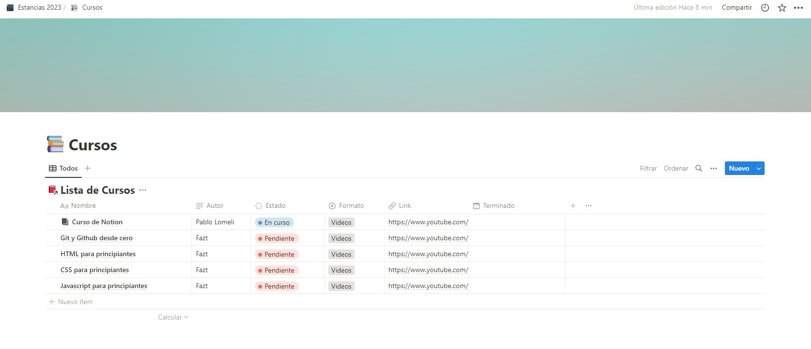
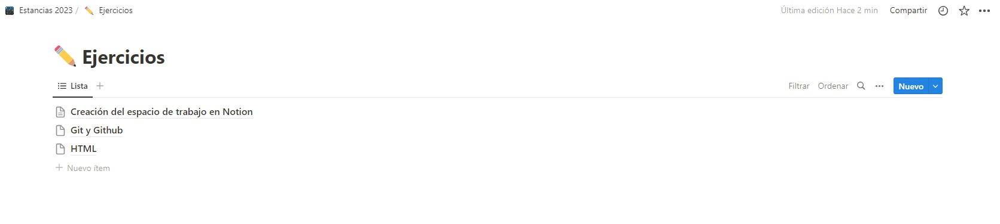

# Documentation Jul/24

## Status
* Taking the *Notion course*, about to finish the 5th video.
* Making my own workspace dedicated to the courses and residency in general.
* Customizing, adding and updating the workspace and its different pages for practice.
* Added a page for courses, exercises, testing and final project.
* Getting use to create the sections and databases.

## Blockers

* At the beginning, it’s a little hard to create new pages or its classification cause the platform is a new tool but I hope it’s not a problem, I just have to practice a bit more to get used to the platform.

## Observations

* By the first impressions, it’s a great platform to get organization to other level.
* It is just a little confusing at the beginning but the making and customization is intuitive so, it is just a matter of time to domain the platform.

