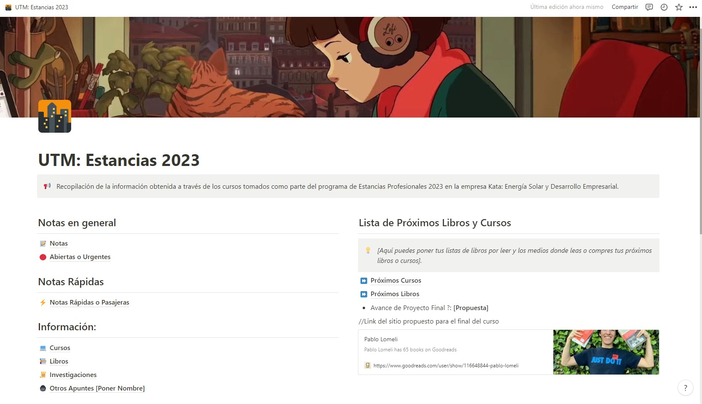
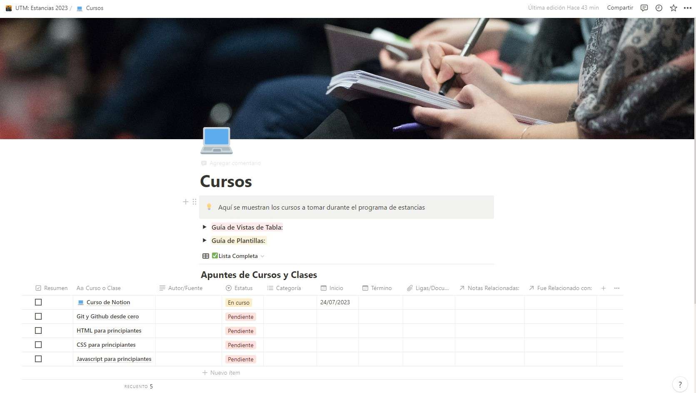

# Documentation Jul/25

## Status

* Taking the Notion course, about to finish the 7th video. I haven’t watched the next videos cause I’m using and organizing my workspace of the platform to put in practice the course information.
* Making my own workspace dedicated to the courses and residency in general.
* I have decided to use the template made by the course creator because it’s nicely complete so, I’m customizing the pages to fit in my interests.

## Blockers

* I’m having a slow progress planning the organization of the course and editing some pages of the template used, nevertheless, I’m getting ability to use the platform so I think that I’ll be able to resolve this as time goes.

## Observations 
* In the last video, I knew Notion AI. At this level of the course, I think that it isn’t too necessary because I’m just learning to use the platform and applying the notes to organize the course, however, it’ll be useful in the future to understand some parts of the course and it can be helpful to resume the topics or generate study material.
* In the main screen, I want to link the final project to have an easy access and do a better progress, by the moment I decided to leave that section as it is.

