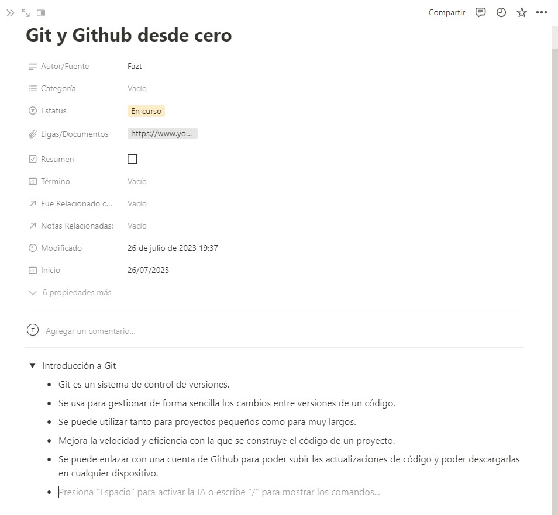
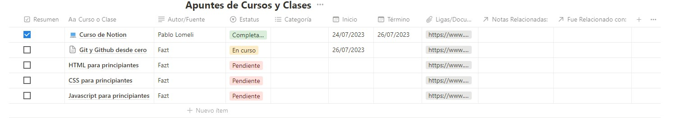
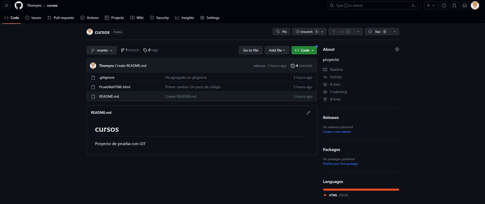
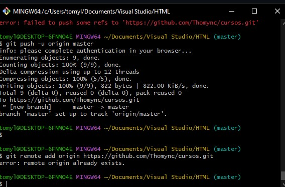

# Documentation Jul/26

## Status

* Finished the Notion course.
* Beginning the Git and Github course. I’ve watched all the video, now I’m reviewing it and doing the examples to practice.
* Adding little notes in the Git and Github page of my workspace.
* I’ve installed VSC and Git.
* I’ve created my profile in Github and synchronized the test project.

## Blockers

* None

## Observations

* I like VSC because it’s a fully complete text editor and, in my opinion a powerful tool for programming.
* This is going to be my last PDF documentation, now I’ll add it in my Github profile.

