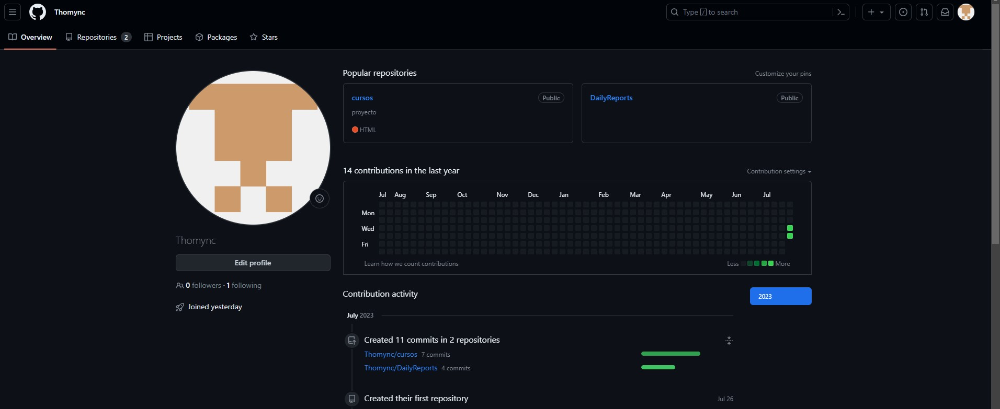
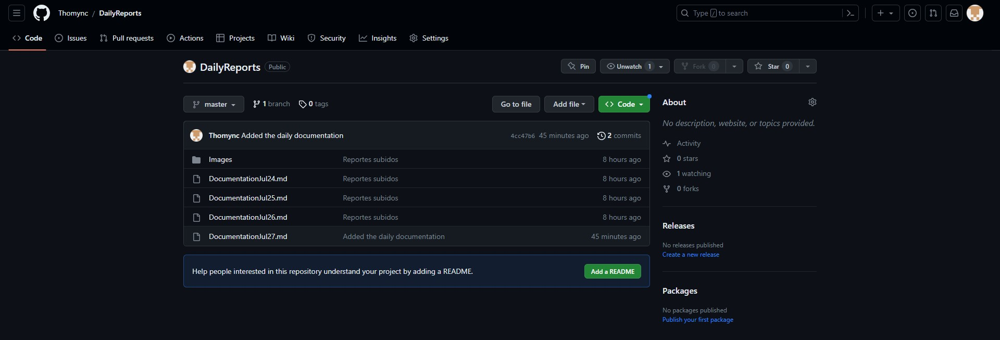

# Documentation Jul/27

## Status

* Now uploading my progress in Markdown format. :smile:
* Converting all the previous documentations to md for practice.
* Adding the *Daily documentation* section.
* Getting more experience with Git.

## Blockers 

* I tried to add my documentation folder to my repository but I couldn't, so I added it to a new repository cause in my last try I created a new branch but I get confused and I deleted.
* I'm practicing Git and some doubts are emerging, like the branch management and the upload of the changes to Gihub. At the moment I think it is practice question.
* I uploaded the necessary images to my repository but now I don't know how to link'em in the MD documents.

## Observations

* I have to do more activities related to Git and Github.

# Update

- [x] Fixed the images problem 😄

- [ ] Update the previous documentation
