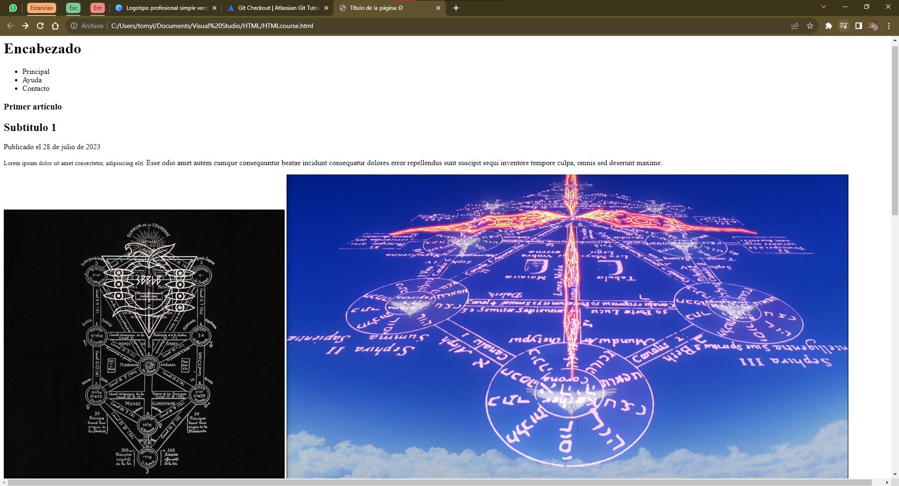
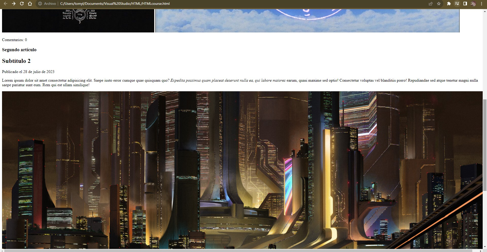
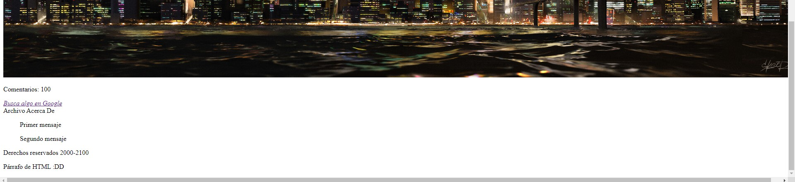
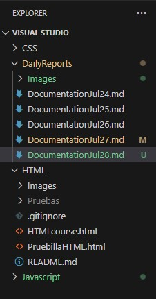

# Documentation Jul/28

## Status

* Corrected all the previous documentation in Github
* Finishing the HTML course.
* Practicing Git, Github and HTML.

## Blockers

* In my second repository **DailyReports**, there is a document in a amber color with and M but I don't know what it means.

## Observations

* I created my first *website* but it is only the base, so I need to begin with the CSS course for a better visual management cause some elements like the images aren't add like I wanted.

