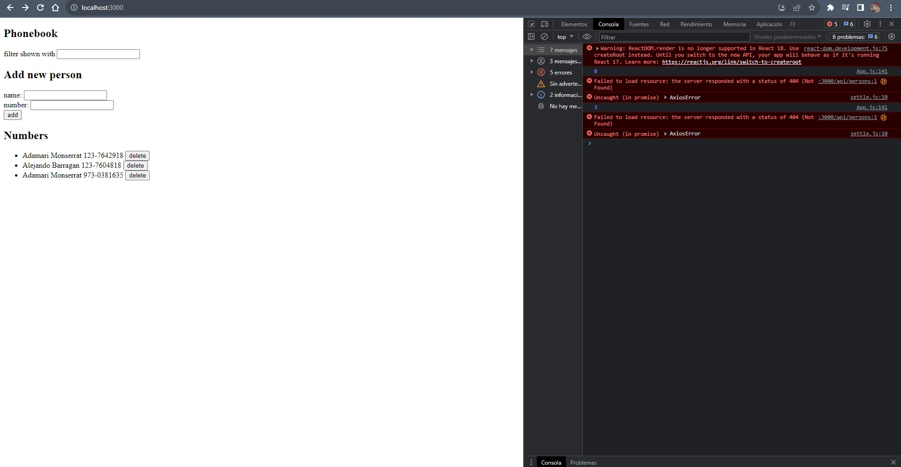

# Documentation Sept/1

## Status

* Completed the second exercises of the part2 of the fullstack course.
* Working in my personal CV website.
* I decided to work in the phonebook exercises today.

## Blockers

* I have a error related with axios but I couldn't fix it.

## Observations

* Worth remembering that the code sources are in the Fullstack and CSS folders.
* In this time, I didn't separate the exercises, now I just finished the last exercise an it include the previous tasks.

